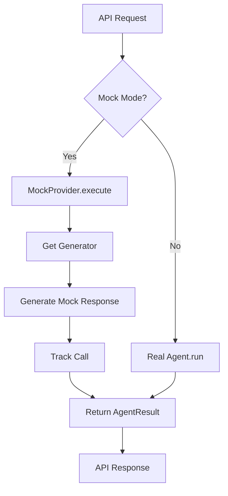

# AI Mock Mode Guide

Complete demo/mock mode for the AI system that allows running without real API calls.

## Overview

Mock mode provides realistic AI responses without making external API calls to Anthropic, OpenAI, or Google. This is useful for:

- **Local development** without API keys
- **Testing** without incurring API costs
- **CI/CD pipelines** for fast, deterministic tests
- **Demos** with predictable behavior

## Activation

Mock mode activates **only** when both conditions are met:

1. `APP_ENV=development`
2. `AI_FAKE_MODE=true`

This ensures mock responses are **never** used in production.

## Quick Start

### 1. Use Development Environment File

```bash
cp backend/.env.development backend/.env
```

The `.env.development` file has all necessary settings:

```bash
APP_ENV=development
AI_FAKE_MODE=true
AI_FAKE_LATENCY_MS=300
AI_FAKE_STREAMING_CHUNK_DELAY_MS=30

# No API keys needed
ANTHROPIC_API_KEY=
OPENAI_API_KEY=
GOOGLE_API_KEY=
```

### 2. Start the Server

```bash
cd backend
uvicorn pilot_space.main:app --reload
```

### 3. Verify Mock Mode

```bash
curl http://localhost:8000/api/v1/debug/mock-status
```

Expected response:
```json
{
  "enabled": true,
  "app_env": "development",
  "ai_fake_mode": true,
  "ai_fake_latency_ms": 300,
  "ai_fake_streaming_chunk_delay_ms": 30
}
```

## Architecture

### Components

1. **MockProvider** (`pilot_space.ai.providers.mock`)
   - Singleton pattern for centralized mock control
   - Checks environment settings
   - Executes mock generators
   - Tracks calls for debugging

2. **MockResponseRegistry** (`pilot_space.ai.providers.mock`)
   - Decorator-based generator registration
   - Maps agent names to generator functions
   - Maintains call history (last 100 calls)

3. **Mock Generators** (`pilot_space.ai.providers.mock_generators`)
   - One generator per agent
   - Returns realistic mock data matching agent schemas
   - Auto-registered via decorators

4. **SDK Orchestrator Integration** (`pilot_space.ai.sdk_orchestrator`)
   - Checks mock mode before executing agents
   - Routes to mock provider when enabled
   - Transparent to API layer

5. **Debug Endpoints** (`pilot_space.api.v1.routers.debug`)
   - Available only in development mode
   - Introspection into mock system state

### Flow



## Supported Agents

All 16 agents have mock generators:

| Agent | Mock Response |
|-------|---------------|
| **GhostTextAgent** | Contextual text completions |
| **AIContextAgent** | Related items, code refs, Claude prompt |
| **PRReviewAgent** | 5-aspect review with comments |
| **IssueExtractorAgent** | Extracted issues with confidence tags |
| **MarginAnnotationAgent** | Block annotations (suggestion/warning/insight) |
| **ConversationAgent** | Contextual conversational responses |
| **IssueEnhancerAgent** | Enhanced descriptions, acceptance criteria |
| **AssigneeRecommenderAgent** | Assignee recommendations with rationale |
| **DuplicateDetectorAgent** | Similar issues with similarity scores |
| **DocGeneratorAgent** | API/feature documentation |
| **TaskDecomposerAgent** | Task breakdown with dependencies |
| **DiagramGeneratorAgent** | Mermaid diagrams (flowchart/sequence) |
| **CommitLinkerAgent** | Linked commits with relevance scores |

## Configuration

### Environment Variables

```bash
# Required for mock mode
APP_ENV=development
AI_FAKE_MODE=true

# Optional tuning (defaults shown)
AI_FAKE_LATENCY_MS=500              # Total response latency
AI_FAKE_STREAMING_CHUNK_DELAY_MS=50 # Delay between stream chunks
```

### Settings Object

```python
from pilot_space.config import get_settings

settings = get_settings()
print(f"Mock enabled: {settings.ai_fake_mode}")
print(f"Environment: {settings.app_env}")
```

## Debug Endpoints

Available at `http://localhost:8000/api/v1/debug/` (development only):

### GET /debug/mock-status

Check if mock mode is active.

```bash
curl http://localhost:8000/api/v1/debug/mock-status
```

Response:
```json
{
  "enabled": true,
  "app_env": "development",
  "ai_fake_mode": true,
  "ai_fake_latency_ms": 300,
  "ai_fake_streaming_chunk_delay_ms": 30
}
```

### GET /debug/mock-calls

View mock call history (last 100 calls).

```bash
curl http://localhost:8000/api/v1/debug/mock-calls
```

Response:
```json
{
  "calls": [
    {
      "agent_name": "GhostTextAgent",
      "input_summary": "{'current_text': 'def process_user', 'cursor_position': 17, 'is_code': true}",
      "output_summary": "user_id: UUID) -> User:",
      "latency_ms": 300,
      "timestamp": 1706234567.89
    }
  ],
  "total": 1
}
```

### POST /debug/mock-calls/clear

Clear mock call history.

```bash
curl -X POST http://localhost:8000/api/v1/debug/mock-calls/clear
```

Response:
```json
{
  "message": "Mock call history cleared successfully"
}
```

### GET /debug/mock-generators

List all registered mock generators.

```bash
curl http://localhost:8000/api/v1/debug/mock-generators
```

Response:
```json
{
  "generators": [
    "GhostTextAgent",
    "AIContextAgent",
    "PRReviewAgent",
    ...
  ],
  "total": 20
}
```

## Testing

### Unit Tests

Run mock mode tests:

```bash
cd backend
uv run pytest tests/unit/ai/test_mock_mode.py -v
```

Tests verify:
- ✅ Activation logic (dev + fake mode required)
- ✅ Mock response generation for all agents
- ✅ Call history tracking
- ✅ Generator registration
- ✅ Environment variable handling

### Integration Tests

Mock mode integrates seamlessly with existing API tests:

```python
import pytest
from pilot_space.config import get_settings

@pytest.fixture(autouse=True)
def enable_mock_mode():
    """Enable mock mode for all tests."""
    import os
    os.environ["APP_ENV"] = "development"
    os.environ["AI_FAKE_MODE"] = "true"
    yield

async def test_ghost_text_api(client):
    """Test ghost text endpoint with mock mode."""
    response = await client.post(
        "/api/v1/ai/ghost-text",
        json={
            "current_text": "def process_",
            "cursor_position": 12,
            "is_code": True,
        },
    )
    assert response.status_code == 200
    assert "suggestion" in response.json()
```

## Adding New Mock Generators

### 1. Create Generator Function

```python
# backend/src/pilot_space/ai/providers/mock_generators.py

@MockResponseRegistry.register("MyNewAgent")
def generate_my_agent_response(input_data: dict[str, Any]) -> dict[str, Any]:
    """Generate mock response for MyNewAgent.

    Args:
        input_data: Dict with agent-specific input keys

    Returns:
        Dict matching MyAgentOutput schema
    """
    return {
        "result": "mock result",
        "confidence": 0.85,
        "metadata": {"mock": True},
    }
```

### 2. Verify Registration

```python
from pilot_space.ai.providers.mock import MockResponseRegistry

registered = MockResponseRegistry.list_registered()
assert "MyNewAgent" in registered
```

### 3. Add Tests

```python
# tests/unit/ai/test_mock_mode.py

@pytest.mark.asyncio
async def test_my_agent_mock(agent_context):
    """Test MyNewAgent mock response."""
    from pilot_space.ai.providers import mock_generators

    mock_agent = AsyncMock(spec=["__class__"])
    mock_agent.__class__.__name__ = "MyNewAgent"

    provider = MockProvider.get_instance()
    result = await provider.execute(
        mock_agent,
        {"input_key": "value"},
        agent_context,
    )

    assert result.success
    assert result.output["result"] == "mock result"
```

## Production Safety

Mock mode has **zero production risk**:

### Guardrails

1. **Environment Check**: `APP_ENV == "development"` required
2. **Explicit Flag**: `AI_FAKE_MODE == True` required
3. **Early Check**: Orchestrator checks mock mode before agent execution
4. **Singleton Pattern**: Centralized control point
5. **Type Safety**: Full type annotations prevent misuse

### Verification

```python
from pilot_space.ai.providers.mock import MockProvider

provider = MockProvider.get_instance()

# In production, this will ALWAYS be False
assert not provider.is_enabled()  # True in prod
```

### CI/CD

Ensure production builds never enable mock mode:

```yaml
# .github/workflows/deploy-production.yml
env:
  APP_ENV: production
  AI_FAKE_MODE: false  # Explicit false in production
```

## Performance

Mock mode is **fast**:

| Metric | Mock Mode | Real API |
|--------|-----------|----------|
| Ghost Text | ~300ms | ~1-2s |
| PR Review | ~300ms | ~10-30s |
| AI Context | ~300ms | ~5-15s |
| Cost per call | $0.0001 | $0.01-$1.00 |

### Tuning

Adjust latency for different scenarios:

```bash
# Fast mode (testing)
AI_FAKE_LATENCY_MS=100
AI_FAKE_STREAMING_CHUNK_DELAY_MS=10

# Realistic mode (demos)
AI_FAKE_LATENCY_MS=500
AI_FAKE_STREAMING_CHUNK_DELAY_MS=50

# Slow network simulation
AI_FAKE_LATENCY_MS=2000
AI_FAKE_STREAMING_CHUNK_DELAY_MS=100
```

## Troubleshooting

### Mock Mode Not Activating

**Symptom**: Real API calls despite `.env.development`

**Solutions**:

1. Verify environment file is loaded:
   ```bash
   curl http://localhost:8000/api/v1/debug/mock-status
   ```

2. Check `.env` file location (must be in `backend/`):
   ```bash
   ls -la backend/.env
   ```

3. Restart server after changing `.env`:
   ```bash
   # Kill and restart uvicorn
   ```

4. Verify settings in Python:
   ```python
   from pilot_space.config import get_settings
   s = get_settings()
   print(f"env={s.app_env}, fake={s.ai_fake_mode}")
   ```

### Missing Mock Generator

**Symptom**: `ValueError: No mock generator registered for AgentName`

**Solutions**:

1. Verify generator is registered:
   ```bash
   curl http://localhost:8000/api/v1/debug/mock-generators
   ```

2. Import `mock_generators` module:
   ```python
   from pilot_space.ai.providers import mock_generators
   ```

3. Check agent name matches exactly:
   ```python
   @MockResponseRegistry.register("ExactAgentClassName")
   def generator(input_data):
       ...
   ```

### Type Errors

**Symptom**: Pyright/mypy errors in mock generators

**Solutions**:

1. Use `dict[str, Any]` for input/output:
   ```python
   def generator(input_data: dict[str, Any]) -> dict[str, Any]:
   ```

2. Import `Any` from typing:
   ```python
   from typing import Any
   ```

## Best Practices

### DO

✅ Use mock mode for local development
✅ Write tests against mock responses
✅ Tune latency for realistic demos
✅ Clear call history between test runs
✅ Verify mock generators return valid schemas

### DON'T

❌ Use mock mode in staging/production
❌ Commit `.env` file with real API keys
❌ Assume mock responses match real API exactly
❌ Skip API integration tests entirely
❌ Hard-code mock mode activation

## Files Reference

### Core Implementation

| File | Purpose |
|------|---------|
| `backend/src/pilot_space/ai/providers/mock.py` | MockProvider, MockResponseRegistry |
| `backend/src/pilot_space/ai/providers/mock_generators.py` | All agent mock generators |
| `backend/src/pilot_space/ai/sdk_orchestrator.py` | Orchestrator integration |
| `backend/src/pilot_space/api/v1/routers/debug.py` | Debug endpoints |

### Configuration

| File | Purpose |
|------|---------|
| `backend/.env.development` | Development environment template |
| `backend/src/pilot_space/config.py` | Settings with mock mode flags |

### Tests

| File | Purpose |
|------|---------|
| `backend/tests/unit/ai/test_mock_mode.py` | Mock mode unit tests |

### Documentation

| File | Purpose |
|------|---------|
| `backend/docs/mock-mode-guide.md` | This guide |

## Summary

Mock mode provides a complete, production-safe system for running the AI layer without API calls. It's activated only in development with explicit configuration, returns realistic responses for all 16 agents, and includes comprehensive debugging tools.

**Key Benefits:**
- 🚀 Fast local development
- 💰 Zero API costs
- 🔒 Production-safe (never activates in prod)
- 🧪 Deterministic testing
- 🎯 Realistic mock responses
- 🐛 Debug endpoints for introspection

**Next Steps:**
1. Copy `.env.development` to `.env`
2. Start server
3. Verify mock mode at `/api/v1/debug/mock-status`
4. Build features without API keys
5. Switch to real APIs when ready
