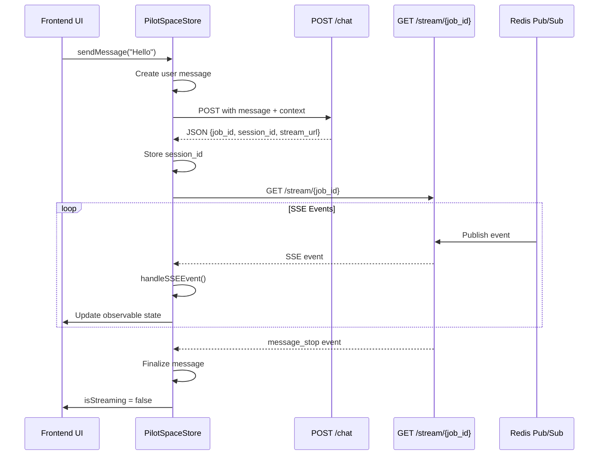
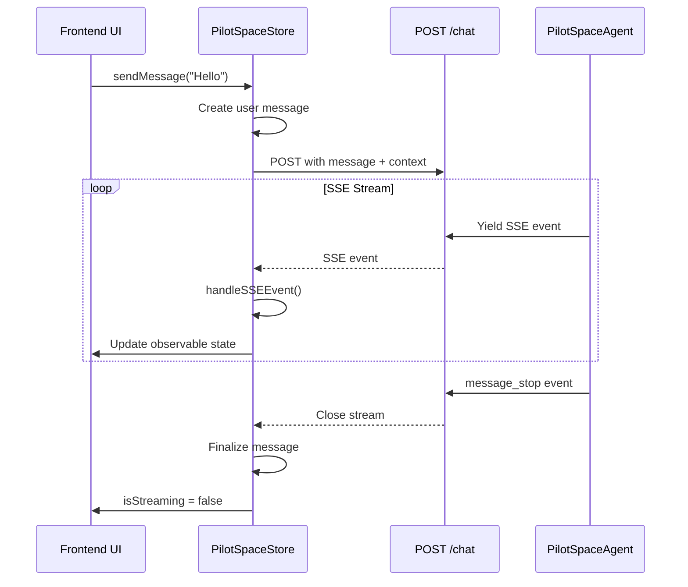

# AI Chat Queue Mode Integration Guide

## Overview

This document explains how the frontend integrates with the backend's queue-based AI chat architecture, supporting both synchronous (direct SSE) and asynchronous (queue + Redis pub/sub) streaming modes.

## Architecture Decision

**Backend modes:**
- **Direct mode** (AI_QUEUE_MODE=false): POST /chat → immediate SSE StreamingResponse
- **Queue mode** (AI_QUEUE_MODE=true): POST /chat → job_id + stream_url → GET /stream/{job_id} → SSE via Redis

**Frontend approach:**
The frontend automatically detects which mode is active by inspecting the Content-Type header of the POST /chat response:
- `application/json` → Queue mode
- `text/event-stream` → Direct mode

## Usage Example

### Basic Chat Integration

```typescript
import { PilotSpaceStore } from '@/stores/ai/PilotSpaceStore';
import { observer } from 'mobx-react-lite';

const ChatComponent = observer(() => {
  const pilotSpaceStore = usePilotSpaceStore();

  // Set context before sending messages
  useEffect(() => {
    pilotSpaceStore.setWorkspaceId('workspace-uuid');
    pilotSpaceStore.setNoteContext({ noteId: 'note-uuid' });
  }, []);

  const handleSendMessage = async (message: string) => {
    // Works seamlessly in both queue and direct mode
    await pilotSpaceStore.sendMessage(message);
  };

  return (
    <div>
      {/* Display messages */}
      {pilotSpaceStore.messages.map(msg => (
        <div key={msg.id}>
          <strong>{msg.role}:</strong> {msg.content}
        </div>
      ))}

      {/* Display streaming content */}
      {pilotSpaceStore.isStreaming && (
        <div className="opacity-70">
          {pilotSpaceStore.streamContent}
        </div>
      )}

      {/* Display active tasks */}
      {pilotSpaceStore.activeTasks.map(task => (
        <div key={task.id}>
          {task.subject}: {task.progress}%
        </div>
      ))}

      {/* Display approval requests */}
      {pilotSpaceStore.pendingApprovals.map(approval => (
        <ApprovalDialog
          key={approval.requestId}
          approval={approval}
          onApprove={() => pilotSpaceStore.approveRequest(approval.requestId)}
          onReject={() => pilotSpaceStore.rejectRequest(approval.requestId)}
        />
      ))}

      <input
        type="text"
        onKeyPress={(e) => {
          if (e.key === 'Enter') {
            handleSendMessage(e.currentTarget.value);
            e.currentTarget.value = '';
          }
        }}
      />
    </div>
  );
});
```

### Multi-Turn Conversations

```typescript
// First message (no session_id)
await pilotSpaceStore.sendMessage('What is TypeScript?');

// Session ID automatically extracted from message_start event
console.log(pilotSpaceStore.sessionId); // → "uuid-v4"

// Subsequent messages automatically include session_id
await pilotSpaceStore.sendMessage('Can you give an example?');
// Backend loads conversation history and maintains context
```

### Context-Aware Conversations

```typescript
// Note context
pilotSpaceStore.setNoteContext({
  noteId: 'note-123',
  noteTitle: 'Project Spec',
  selectedText: 'User authentication flow',
  selectedBlockIds: ['block-1', 'block-2'],
});

await pilotSpaceStore.sendMessage('Extract issues from this selection');

// Issue context
pilotSpaceStore.setIssueContext({
  issueId: 'issue-456',
  issueTitle: 'Implement OAuth',
  issueStatus: 'in_progress',
});

await pilotSpaceStore.sendMessage('Generate implementation plan');
```

## Implementation Details

### Request Flow

#### Queue Mode (AI_QUEUE_MODE=true)



#### Direct Mode (AI_QUEUE_MODE=false)



### SSE Event Types

All events follow the same structure regardless of mode:

| Event Type | Description | Frontend Action |
|------------|-------------|----------------|
| `message_start` | New message begins | Store session_id, create message placeholder |
| `text_delta` | Streaming text chunk | Accumulate in streamContent |
| `tool_use` | Agent invokes tool | Add tool call to message.toolCalls |
| `tool_result` | Tool execution result | Update tool call status/output |
| `task_progress` | Long-running task update | Update task in tasks Map |
| `approval_request` | Human approval needed | Add to pendingApprovals array |
| `message_stop` | Message complete | Create final message with metadata |
| `error` | Error occurred | Set error state, reset streaming |

### Code Architecture

```
PilotSpaceStore
├── sendMessage(content, metadata)
│   ├── POST /api/v1/ai/chat
│   ├── Detect mode by Content-Type
│   │   ├── application/json → connectToStream()
│   │   └── text/event-stream → consumeSSEStream()
│   └── handleSSEEvent() for all events
│
├── connectToStream(streamUrl, jobId) [Queue mode]
│   ├── Create SSEClient with method='GET'
│   └── Connect to GET /stream/{job_id}
│
├── consumeSSEStream(response) [Direct mode]
│   ├── Read response.body stream
│   ├── parseSSEBuffer() for each chunk
│   └── handleSSEEvent() for parsed events
│
├── handleSSEEvent(event)
│   ├── message_start → handleMessageStart()
│   ├── text_delta → handleTextDelta()
│   ├── tool_use → handleToolUseStart()
│   ├── tool_result → handleToolResult()
│   ├── task_progress → handleTaskUpdate()
│   ├── approval_request → handleApprovalRequired()
│   ├── message_stop → handleTextComplete()
│   └── error → handleError()
│
└── parseSSEBuffer(buffer)
    └── Split by \n\n, parse event:/data: lines
```

## Testing

### Manual Testing - Queue Mode

```bash
# Terminal 1: Backend with queue mode
cd backend
export AI_QUEUE_MODE=true
export REDIS_URL=redis://localhost:6379
uvicorn pilot_space.main:app --reload

# Terminal 2: Frontend
cd frontend
pnpm dev

# Browser Console:
# 1. Open chat interface
# 2. Send message
# 3. Inspect Network tab:
#    - POST /chat → 200 (application/json)
#    - GET /stream/{job_id} → 200 (text/event-stream)
# 4. Verify streaming works
# 5. Send follow-up message
# 6. Verify session_id included in request
```

### Manual Testing - Direct Mode

```bash
# Terminal 1: Backend without queue mode
cd backend
export AI_QUEUE_MODE=false
uvicorn pilot_space.main:app --reload

# Terminal 2: Frontend (same as above)
cd frontend
pnpm dev

# Browser Console:
# 1. Send message
# 2. Inspect Network tab:
#    - POST /chat → 200 (text/event-stream)
# 3. Verify streaming works
# 4. Send follow-up message
# 5. Verify session_id included
```

### Automated Testing

```bash
cd frontend
pnpm test src/stores/ai/__tests__/PilotSpaceStore.queue-mode.test.ts
```

## Troubleshooting

### Issue: Stream not connecting in queue mode

**Symptoms:**
- POST /chat succeeds but no events appear
- GET /stream/{job_id} returns 404

**Diagnosis:**
```typescript
// Check stream_url in response
const response = await fetch('/api/v1/ai/chat', {
  method: 'POST',
  body: JSON.stringify({ message: 'test' })
});
const data = await response.json();
console.log('Stream URL:', data.stream_url);
// Should be: /api/v1/ai/chat/stream/{job_id}
```

**Fix:**
- Verify backend AI_QUEUE_MODE=true
- Verify Redis is running and accessible
- Check backend logs for queue errors

### Issue: Session not preserved across messages

**Symptoms:**
- Each message starts new conversation
- AI doesn't remember previous context

**Diagnosis:**
```typescript
// Check session_id storage
console.log('Session ID before:', pilotSpaceStore.sessionId);
await pilotSpaceStore.sendMessage('First');
console.log('Session ID after:', pilotSpaceStore.sessionId);
// Should be: "uuid-v4" after first message
```

**Fix:**
- Verify message_start event includes sessionId
- Check handleMessageStart() stores session_id
- Verify subsequent requests include session_id in body

### Issue: CORS errors in development

**Symptoms:**
- Fetch blocked by CORS policy
- No response from backend

**Fix:**
```python
# backend/src/pilot_space/main.py
app.add_middleware(
    CORSMiddleware,
    allow_origins=["http://localhost:3000"],
    allow_credentials=True,
    allow_methods=["*"],
    allow_headers=["*"],
)
```

## Performance Considerations

### Queue Mode Benefits
- Backend doesn't block request thread during AI generation
- Supports horizontal scaling with multiple workers
- Enables request prioritization and rate limiting
- Better resource utilization under load

### Direct Mode Benefits
- Lower latency (no queue overhead)
- Simpler architecture (no Redis dependency)
- Easier debugging (synchronous flow)
- Good for development and low-traffic deployments

### Recommendation
- **Development**: Direct mode (AI_QUEUE_MODE=false)
- **Production**: Queue mode (AI_QUEUE_MODE=true) with Redis cluster

## Migration Guide

### From Direct to Queue Mode

**Backend:**
```bash
# .env
AI_QUEUE_MODE=true
REDIS_URL=redis://localhost:6379
```

**Frontend:**
No changes required! The frontend automatically detects and adapts.

**Deployment:**
1. Deploy Redis cluster
2. Deploy backend with AI_QUEUE_MODE=true
3. Deploy queue worker processes
4. Monitor queue metrics (depth, latency)

### Rollback Plan

If queue mode causes issues:

```bash
# Backend: Disable queue mode
export AI_QUEUE_MODE=false

# Restart backend
uvicorn pilot_space.main:app --reload
```

Frontend continues working without changes.

## Future Enhancements

1. **Reconnection**: Implement `useConversationReconnect` for automatic recovery
2. **Offline Support**: Cache partial responses in IndexedDB
3. **Priority Queues**: High-priority requests bypass queue
4. **Streaming Metrics**: Track latency, throughput, error rates
5. **Queue UI**: Admin dashboard for queue monitoring
